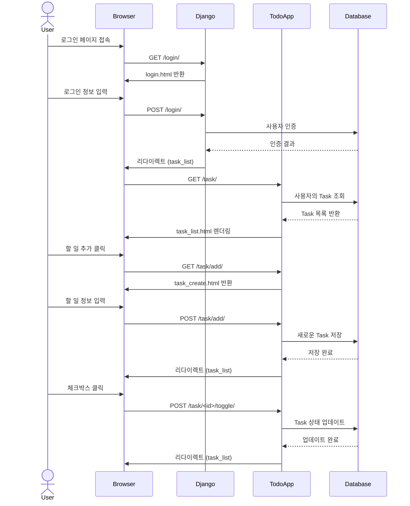

# Django To-Do List with Docker
---

## 프로젝트 요약

이 프로젝트는 Django를 활용하여 할 일(To-Do) 관리 기능을 제공하는 웹 애플리케이션입니다. 

REST API와 사용자 인증 기능을 포함하며, Docker 및 Docker Compose를 사용하여 MySQL 데이터베이스와 Django 애플리케이션을 컨테이너화했습니다.

**개발자로서의 역량**을 보여주기 위한 포트폴리오 용도로 개발되었으며, 컨테이너 기반 개발과 배포 환경 구축 경험을 중점적으로 다룹니다.

---

## 프로젝트 목적

- **기술 학습**: Django와 Docker를 활용한 웹 애플리케이션 설계 및 컨테이너화 실습.
- **포트폴리오 제작**: 개발자로서의 역량을 효과적으로 표현.
- **REST API 설계**: Django REST Framework와 Swagger를 사용하여 API 설계와 문서화.
- **도전 과제 해결**: 컨테이너 의존성 관리 및 데이터베이스 연동 문제를 직접 해결.

---

## 디렉토리 구조

```plaintext
.
├── Dockerfile
├── docker-compose.yml
├── requirements.txt
├── todolist
│   ├── db.sqlite3
│   ├── manage.py
│   ├── static
│   │   └── styles.css
│   ├── templates
│   │   ├── base.html
│   │   ├── login.html
│   │   ├── signup.html
│   │   └── todoApp
│   │       ├── task_create.html
│   │       ├── task_delete.html
│   │       ├── task_detail.html
│   │       ├── task_list.html
│   │       └── task_update.html
│   ├── todoApp
│   │   ├── admin.py
│   │   ├── apps.py
│   │   ├── forms.py
│   │   ├── migrations
│   │   ├── models.py
│   │   ├── serializers.py
│   │   ├── tests.py
│   │   ├── urls.py
│   │   └── views.py
│   ├── todolist
│   │   ├── settings.py
│   │   ├── urls.py
│   │   └── wsgi.py
│   └── users
│       ├── admin.py
│       ├── apps.py
│       ├── models.py
│       ├── tests.py
│       ├── urls.py
│       └── views.py
└── wait-for-it.sh
```

---

## 주요 기능

1. **CRUD**:
   - 할 일(Task)의 생성(Create), 읽기(Read), 수정(Update), 삭제(Delete) 기능 제공.
2. **사용자 인증**:
   - Django 기본 인증 시스템 사용 (로그인, 로그아웃, 회원가입).
3. **REST API**:
   - Django REST Framework로 설계된 API 제공.
   - Swagger(drf-yasg)를 사용하여 API 문서화.
4. **Docker 지원**:
   - MySQL과 Django 애플리케이션을 각각 컨테이너로 분리하여 관리.
5. **컨테이너 의존성 관리**:
   - `wait-for-it.sh` 스크립트를 사용하여 MySQL 컨테이너가 준비되었는지 확인 후 Django 컨테이너 실행.

---

## 기술 스택

- **언어**: Python
- **프레임워크**: Django, Django REST Framework
- **데이터베이스**: MySQL
- **컨테이너화**: Docker, Docker Compose
- **API 문서화**: Swagger (drf-yasg)
- **기타 도구**: Git, `wait-for-it.sh` (컨테이너 의존성 관리)

---

## 기능 흐름 시퀀스 다이어그램



---

## AS-IS, Challenge, TO-BE

### AS-IS
- **문제 상황**:
  - 초기에는 Django 내장 뷰와 템플릿을 이용해 웹 애플리케이션을 구성.
  - REST API를 통해 데이터 교환을 지원하려 했으나, 엔드포인트 설계 및 문서화의 필요성을 느낌.
  - 컨테이너 실행 시 MySQL이 준비되지 않아 Django에서 데이터베이스 연결 실패.

### Challenge
- **REST API 설계와 구현**:
  - Django REST Framework를 사용하여 CRUD 엔드포인트를 설계.
  - 엔드포인트마다 인증이 필요하도록 `IsAuthenticated` 권한 적용.
  - Swagger(drf-yasg)를 활용하여 API 문서를 자동 생성.
- **컨테이너 의존성 문제 해결**:
  - `wait-for-it.sh` 스크립트를 사용해 MySQL이 준비될 때까지 Django 실행을 지연.
- **API 테스트**:
  - Django의 테스트 프레임워크를 이용해 REST API 엔드포인트에 대한 통합 테스트 작성.
  - MySQL과의 연결 문제를 해결하기 위해 로컬 데이터베이스와의 테스트 환경을 설정.

### TO-BE
- **REST API 기능 구현**:
  - API 엔드포인트를 통해 할 일(Task) 데이터에 접근 가능.
  - `GET`, `POST`, `PUT`, `DELETE` 메서드 지원.
  - Swagger 문서를 통해 클라이언트가 엔드포인트를 테스트하고 활용 가능.
- **컨테이너 기반 개발 환경 완성**:
  - MySQL과 Django 컨테이너가 독립적으로 실행되며, 상호 의존성을 성공적으로 관리.
  - 모든 의존성이 명확히 정의된 Docker Compose 파일 제공.

---

## 프로젝트 실행 방법

### 1. Docker 및 Docker Compose 설치
Docker와 Docker Compose가 로컬 시스템에 설치되어 있어야 합니다.

- [Docker 설치 가이드](https://docs.docker.com/get-docker/)
- [Docker Compose 설치 가이드](https://docs.docker.com/compose/install/)

### 2. 레포지토리 클론
```bash
git clone https://github.com/online5880/django-todo-list
cd django-todo-list
```

### 3. 컨테이너 빌드 및 실행
```bash
docker-compose up --build
```

### 4. 브라우저에서 확인
`http://127.0.0.1:8000`에 접속하여 To-Do List 앱 실행 여부를 확인합니다.

---

## API 사용 예제 (로그인 후)

### 1. Task 목록 조회 (GET /tasks/)
```bash
curl -X GET http://127.0.0.1:8000/task/api/tasks/ -H "Authorization: Token <your_token>"
```

### 2. Task 생성 (POST /tasks/)
```bash
curl -X POST http://127.0.0.1:8000/task/api/tasks/ \
  -H "Content-Type: application/json" \
  -H "Authorization: Token <your_token>" \
  -d '{"title": "새로운 할 일", "description": "설명", "completed": false}'
```

### 3. Task 상세 조회 (GET /tasks/{id}/)
```bash
curl -X GET http://127.0.0.1:8000/task/api/tasks/1/ -H "Authorization: Token <your_token>"
```

### 4. Task 수정 (PUT /tasks/{id}/)
```bash
curl -X PUT http://127.0.0.1:8000/task/api/tasks/1/ \
  -H "Content-Type: application/json" \
  -H "Authorization: Token <your_token>" \
  -d '{"title": "수정된 할 일", "description": "수정된 설명", "completed": true}'
```

### 5. Task 일부 수정 (PATCH /tasks/{id}/)
```bash
curl -X PATCH http://127.0.0.1:8000/task/api/tasks/1/ \
  -H "Content-Type: application/json" \
  -H "Authorization: Token <your_token>" \
  -d '{"completed": true}'
```

### 6. Task 삭제 (DELETE /tasks/{id}/)
```bash
curl -X DELETE http://127.0.0.1:8000/task/api/tasks/1/ -H "Authorization: Token <your_token>"
```

---

## 배운 점 및 어려웠던 점

1. **Docker 및 Docker Compose**:
   - MySQL과 Django 간의 의존성 문제를 해결하며 컨테이너 기반 개발 환경 구축의 중요성을 배움.
2. **REST API 설계 및 문서화**:
   - Swagger를 통해 API 문서화를 자동화하며 RESTful 설계의 중요성을 체득.
3. **파일 경로 및 설정 문제 해결**:
   - 디렉토리 구조와 Docker 설정 파일의 상관관계를 이해하고 정확히 설정.

---

## 결과 이미지

- 로그인 페이지


- 회원가입 페이지


- 리스트 페이지


- 생성 페이지


- 업데이트 페이지


- 삭제 페이지


- 상세 페이지


- 리스트 체크(Ajax)


- REST API 페이지


- Swagger 페이지


